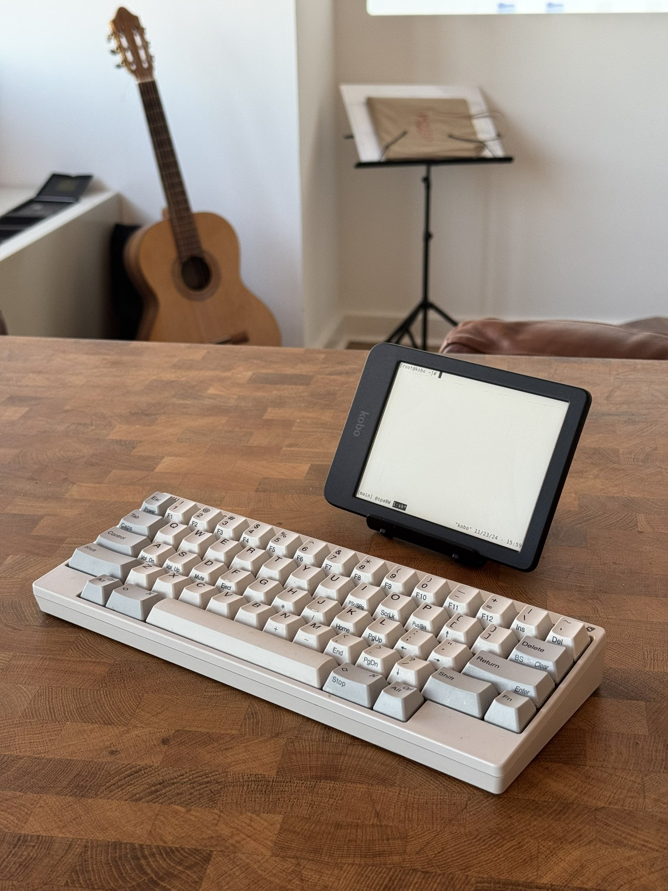
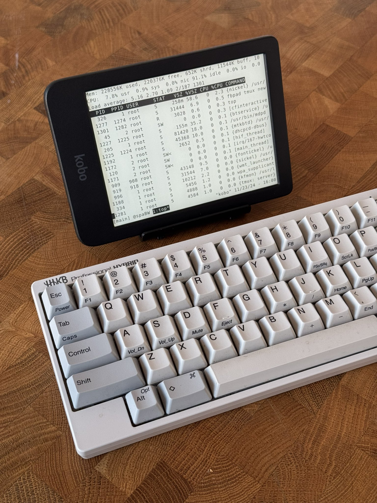

# efbpad

A bluetooth keyboard terminal for a Kobo Clara BW.

See the [TODO.md](TODO.md).
Also see a related repo, [kobo-emacs](https://github.com/enthdegree/kobo-emacs/)

<p align="center">
  
  
</p>

This is completely untested works-for-me-ware. Although this doesn't touch any non-user directories, you could still brick your device if you don't know what you're doing so be careful. 

## Build and Install

 - On the Kobo, install kfmon and nickelmenu if you haven't already.
 - Run `make` to produce an update package `KoboRoot.tgz`.
   This requires a cross-compiling environment.
   NiLuJe's `koxtoolchain` kobo env is the path of least resistance.
 - Merge the contents of the package with the kobo's `/mnt/onboard` (n.b. there are files starting with `.`).
   Alternatively, put the tarball in `/mnt/onboard/.kobo/KoboRoot.tgz` and reboot. 
   Either will create an `efbpad` entry in kfmon, nickelmenu and koreader's Tools menu.

### Prebuilt
Instead of compiling everything you can try things out with a (maybe out-of-date) pre-built package [here](https://mega.nz/folder/mU4kQa7L#9MGGHw2HltTiviuZUtqynw).
  
## Usage

 - Before starting, pair your bluetooth keyboard through the Kobo UI.
 - While your bluetooth keyboard is set to attempt to pair with the Kobo, run efbpad from any of the above launchers.
   At startup efbpad (`efbpad.sh`) will:
   - `source /mnt/onboard/.efbpad_profile` if it exists.
   - Turn on the Kobo's bluetooth.
   - Try and open the event device at `/dev/input/event3` to use as the keyboard.
     If no device is there, it'll wait 5 seconds after bluetooth up for the keyboard to appear. 
 - efbpad shuts down and cleans up if it never finds a keyboard, if the keyboard disconnects or if the shell terminates.
   (The last case requires that you type an extra char on the keyboard to exit).

NiLuJe has helpfully provided a package containing busybox, tmux and ssh
[here](https://www.mobileread.com/forums/showthread.php?t=254214).
As described in the link, it creates several tunnels via udev rule (then `/usr/local/stuff/bin/stuff-daemons.sh`) which should be disabled with
```
touch /mnt/onboard/niluje/usbnet/etc/NO_TELNET
touch /mnt/onboard/niluje/usbnet/etc/NO_SSH
```

For uninstallation, efbpad creates these files and directories:
 - `/mnt/onboard/.adds/efbpad`
 - `/mnt/onboard/fonts/tf`
 - `/mnt/onboard/efbpad.png` 
 - `/mnt/onboard/.adds/kfmon/config/efbpad.ini`
 - `/mnt/onboard/.adds/koreader/plugins/efbpad.koplugin`

### Fonts
`fbpad` will look for fonts at `/mnt/onboard/fonts/tf/{regular,bold,italic}.tf`.
If `.efbpad_profile` sets the `EFBPAD_FONT` env var then `/mnt/onboard/fonts/tf/${EFBPAD_FONT}_{regular,bold,italic}.tf` will be copied to that location for use.

The included fonts were produced on the kobo as so, running from a folder containing DejaVu ttfs:
```
mkfn -h 44 -w 24 DejaVuSansMono.ttf:42 > /mnt/onboard/fonts/tf/large_regular.tf
mkfn -h 44 -w 24 DejaVuSansMono-Bold.ttf:42 > /mnt/onboard/fonts/tf/large_bold.tf
mkfn -h 44 -w 24 DejaVuSansMono-Oblique.ttf:42 > /mnt/onboard/fonts/tf/large_italic.tf
mkfn -h 36 -w 18 DejaVuSansMono.ttf:31 > /mnt/onboard/fonts/tf/small_regular.tf
mkfn -h 36 -w 18 DejaVuSansMono-Bold.ttf:31 > /mnt/onboard/fonts/tf/small_bold.tf
mkfn -h 36 -w 18 DejaVuSansMono-Oblique.ttf:31 > /mnt/onboard/fonts/tf/small_italic.tf
```

## Project Structure
Broadly, we string together 4 components. 
An effort has been made to keep them as decoupled as possible.
 - `FBInk`: A library for eink screen drawing by NiLuJe.
 - `fbpad`: A framebuffer terminal emulator by aligrudi.
   We use a very lightly patched version of fbpad: it occasionally
   makes a call to FBInk to refresh the screen.
    - Here we follow the example of a similar project, `fbpad-eink`, which
      took a more integrated approach to refreshes and had a different
      keyboard system.
 - `kbreader`: Under proper conditions keyboards appear in linux as
   event devices. `kbreader` acts as the interpreter to translate keystrokes
   coming out of an event device into strings printed to stdout.
   This is a standalone utility.
   When you start `fbpad` it waits for chars from stdin. We get `fbpad`
   to listen to the keyboard by piping kbreader into it as so:
   `kbreader /dev/input/event3 | fbpad the_shell`.
    - `kbreader` is spiritually identical to the onscreen keyboard in
      a similar project `inkvt`, except our keyboard reader is decoupled
      from the rest of the software, our event device is not a touchscreen,
      and we use fbpad instead of a bespoke VT.
 - `efbpad.sh`: Script that does efbpad startup & shutdown.
